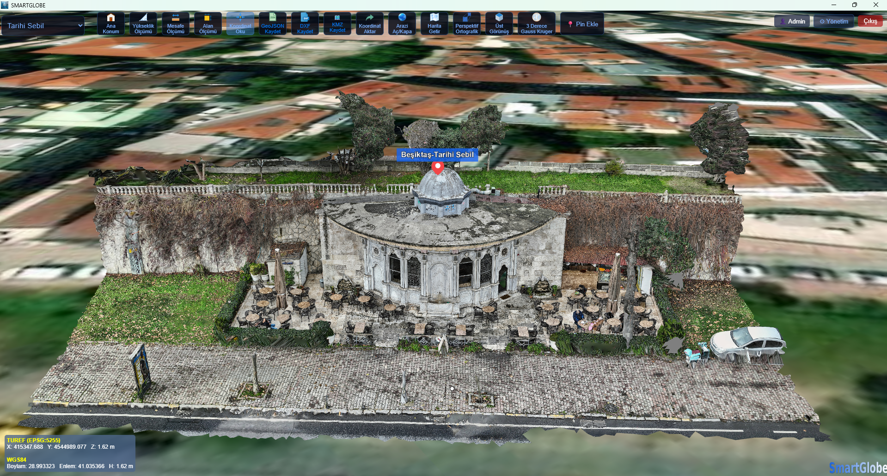
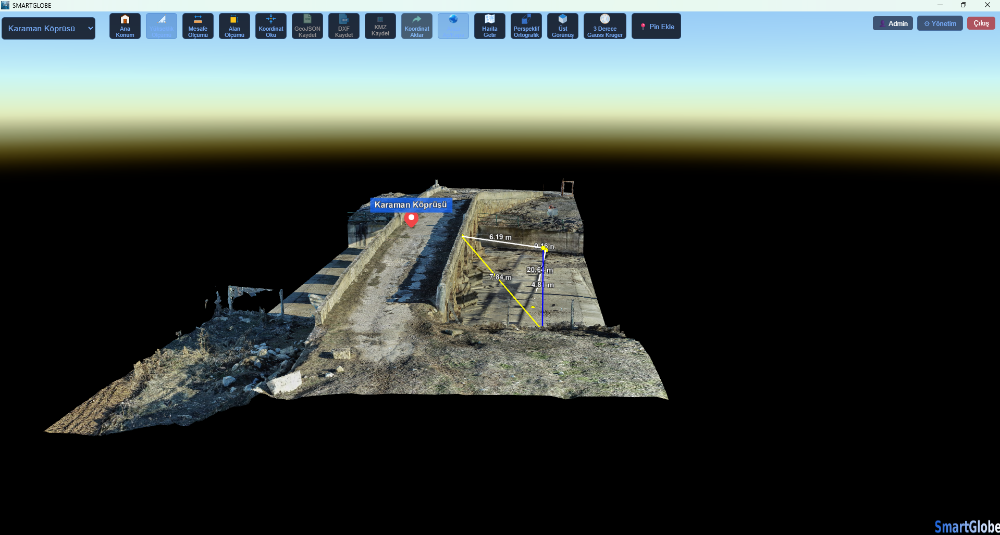
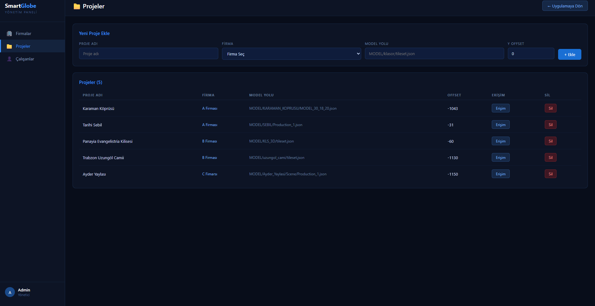
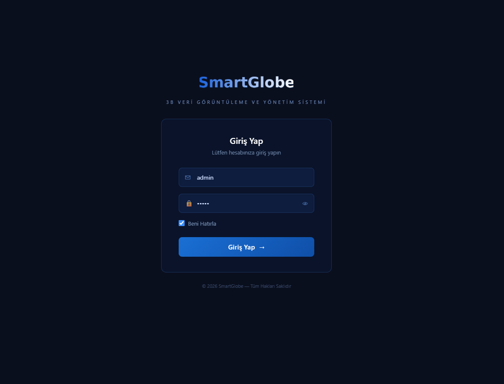

# SmartGlobe

**3B Veri Görüntüleme ve Yönetim Sistemi**

CesiumJS tabanlı, büyük hacimli 3B model verilerinin web ortamında detay kaybı olmadan görüntülenmesini ve yönetilmesini sağlayan uçtan uca bir uygulama. Web ve masaüstü sürümleri mevcuttur.

---

## Özellikler

### 3B Görüntüleme
- Cesium 3D Tiles formatındaki büyük veri setlerinin akıcı görüntülenmesi
- Arazi (terrain) katmanı ve uydu haritası desteği
- Perspektif / ortografik projeksiyon geçişi
- Üst görünüş ve ana konum kısayolları

### Ölçüm Araçları
- **Mesafe ölçümü** — çok noktalı, ara segment etiketleriyle
- **Alan ölçümü** — yerel düzleme projeksiyon ve Shoelace algoritması ile hesaplama
- **Yükseklik ölçümü** — iki nokta arasındaki kot farkı
- **Koordinat okuma** — imleç konumunun anlık koordinatı

### Koordinat ve Dışa Aktarma
- TUREF / 3 derecelik Gauss-Krüger dönüşümü, otomatik dilim (zone) tespiti
- 3 derecelik meridyen çizgilerinin harita üzerinde gösterimi
- **GeoJSON**, **DXF** ve **KMZ** formatlarında dışa aktarma
- Koordinat listesinin TXT olarak aktarılması

### İşaretleme
- Harita üzerine açıklamalı pin ekleme
- Sürükle-bırak ile konum güncelleme

### Kullanıcı ve Yetki Yönetimi
- JWT token tabanlı oturum yönetimi
- Rol bazlı yetkilendirme: **Admin** ve **Çalışan**
- Çalışanlar yalnızca kendilerine atanmış projelere erişebilir
- Yönetim panelinden firma, proje ve kullanıcı yönetimi
- Parolalar bcrypt ile hash'lenerek saklanır

---

## Ekran Görüntüleri

### 3B Görüntüleme
Tarihi Sebil (Beşiktaş) modeli üzerinde işaretleme ve anlık koordinat okuması. Sol altta TUREF (EPSG:5255) ve WGS84 koordinatları eş zamanlı gösterilir.



### Ölçüm Araçları
Karaman Köprüsü modeli üzerinde mesafe ve yükseklik ölçümü.



### Yönetim Paneli
Firma, proje ve çalışan yönetimi; proje bazlı erişim yetkilendirmesi.



### Giriş Ekranı



---

## Teknolojiler

| Katman | Teknolojiler |
|---|---|
| Frontend | CesiumJS, 3D Tiles, JavaScript (ES6), HTML5, CSS3, proj4js, JSZip |
| Backend | Node.js, Express.js, REST API |
| Veri tabanı | MS SQL Server (mssql) |
| Kimlik doğrulama | JWT (jsonwebtoken), bcryptjs |
| Masaüstü | C# WinForms + WebView2 |

---

## Kurulum

### Gereksinimler
- Node.js 18 veya üzeri
- MS SQL Server
- [CesiumJS](https://cesium.com/platform/cesiumjs/) (sürüm 1.133)

### 1. Depoyu klonlayın

```bash
git clone https://github.com/KULLANICI-ADINIZ/smartglobe.git
cd smartglobe
```

### 2. CesiumJS kütüphanesini ekleyin

Boyutu nedeniyle depoya dahil edilmemiştir. [cesium.com](https://cesium.com/downloads/) adresinden indirip proje kök dizinine `cesium_1_133/` adıyla yerleştirin.

### 3. Veri tabanını hazırlayın

MS SQL Server üzerinde `SmartGlobeDB` adında bir veritabanı ve aşağıdaki tabloları oluşturun:

| Tablo | Açıklama |
|---|---|
| `kullanicilar` | id, kullanici_adi, sifre, ad_soyad, rol, aktif |
| `firmalar` | id, ad, yetkili, telefon, adres, tarih |
| `projeler` | id, ad, model_yolu, y_offset, firma_id, aktif |
| `kullanici_proje` | kullanici_id, proje_id (yetki eşleştirme) |

> `sifre` sütunu bcrypt hash'i için en az `VARCHAR(60)`, tercihen `VARCHAR(255)` olmalıdır.

### 4. Ortam değişkenlerini ayarlayın

```bash
cd server
cp .env.example .env
```

`.env` dosyasını düzenleyin:

```env
DB_USER=kullanici_adiniz
DB_PASSWORD=sifreniz
DB_SERVER=localhost
DB_NAME=SmartGlobeDB

JWT_SECRET=uzun_rastgele_bir_anahtar
JWT_SURE=8h

PORT=3000
CORS_ORIGIN=http://localhost:3000
```

JWT anahtarı üretmek için:

```bash
node -e "console.log(require('crypto').randomBytes(48).toString('hex'))"
```

### 5. Backend sunucusunu başlatın

```bash
cd server
npm install
npm start
```

Başarılı çıktı:

```
veritabanina baglandi
sunucu 3000 portunda calisiyor
```

API `http://localhost:3000` adresinde çalışır. Uygulamayı kullanmadan önce bu sunucunun **çalışır durumda olması gerekir**.

### 6. Arayüzü açın

Proje dosyaları bir web sunucusu üzerinden sunulmalıdır (3D Tiles verileri `file://` protokolü üzerinden yüklenmez).

**XAMPP ile:**
1. Proje klasörünü `C:\xampp\htdocs\` altına yerleştirin
2. XAMPP Control Panel'den Apache'yi başlatın
3. Tarayıcıda `http://localhost/SMARTGLOBE/login.html` adresini açın

**Alternatif olarak** VS Code Live Server veya benzeri bir statik sunucu da kullanılabilir.

### Mevcut kurulumu güncelliyorsanız

Daha önce düz metin parola kullanan bir kurulumdan geçiş yapıyorsanız, veritabanı yedeğini aldıktan sonra:

```bash
node scripts/sifreleri-hashle.js
```

Script yalnızca hash'lenmemiş parolaları dönüştürür, birden fazla kez çalıştırmak zararsızdır.

---

## Masaüstü Sürümü

`SmartGlobe-Desktop/` klasöründe, uygulamanın C# WinForms + WebView2 ile hazırlanmış masaüstü sürümü bulunur. WebView2 bileşeni web arayüzünü yerel bir pencerede çalıştırır; böylece uygulama tarayıcı adres çubuğu olmadan, kendi ikonu ve penceresiyle bir masaüstü programı gibi kullanılır.

**Derlemek için:**
1. `SmartGlobe-Desktop/SmartGlobe.csproj` dosyasını Visual Studio ile açın
2. NuGet paketlerini geri yükleyin (`Microsoft.Web.WebView2`)
3. Build alın

**Çalıştırmadan önce** backend sunucusunun ve web sunucusunun (XAMPP) çalışıyor olması gerekir — masaüstü sürümü bunları otomatik başlatmaz.

---

## 3B Veri Setleri

Uygulama **Cesium 3D Tiles** formatındaki veri setleriyle çalışır. Örnek veriler, boyut ve veri gizliliği nedeniyle depoya dahil edilmemiştir.

Kendi verinizi kullanmak için:

1. Fotogrametri veya Lidar çıktınızı 3D Tiles formatına dönüştürün
2. Oluşan klasörü `MODEL/` altına yerleştirin
3. Yönetim panelinden **Proje Ekle** ile `tileset.json` yolunu tanımlayın
4. Ana ekrandaki proje listesinden seçerek görüntüleyin

---

## API Uç Noktaları

| Metot | Yol | Yetki | Açıklama |
|---|---|---|---|
| POST | `/api/login` | — | Giriş, JWT token döner |
| GET | `/api/kullanicilar` | Admin | Kullanıcı listesi |
| POST | `/api/kullanicilar` | Admin | Kullanıcı ekle |
| DELETE | `/api/kullanicilar/:id` | Admin | Kullanıcı sil |
| GET | `/api/firmalar` | Admin | Firma listesi |
| POST | `/api/firmalar` | Admin | Firma ekle |
| DELETE | `/api/firmalar/:id` | Admin | Firma sil |
| GET | `/api/projeler` | Tümü | Proje listesi (role göre filtrelenir) |
| POST | `/api/projeler` | Admin | Proje ekle |
| DELETE | `/api/projeler/:id` | Admin | Proje sil |
| POST | `/api/yetki` | Admin | Kullanıcıya proje ata |
| DELETE | `/api/yetki` | Admin | Kullanıcıdan proje kaldır |

Korumalı uç noktalar `authorization` başlığında geçerli bir JWT token bekler.

---

## Proje Yapısı

```
smartglobe/
├── index.html            # Ana görüntüleyici arayüzü
├── login.html            # Giriş ekranı
├── panel.html            # Yönetim paneli
├── smartglobe.js         # Görüntüleyici mantığı, ölçüm ve dışa aktarma
├── smartglobe.css        # Arayüz stilleri
├── icon/ logo/ fonts/    # Arayüz varlıkları
├── docs/                 # Ekran görüntüleri
├── cesium_1_133/         # CesiumJS (depoya dahil değil)
├── MODEL/                # 3B veri setleri (depoya dahil değil)
├── SmartGlobe-Desktop/   # C# WinForms + WebView2 masaüstü sürümü
└── server/
    ├── server.js         # Express API sunucusu
    ├── package.json
    ├── .env.example
    └── scripts/
        └── sifreleri-hashle.js
```

---

## Geliştirme Notları

Proje, Ahmet Yesevi Üniversitesi Bilgisayar Programcılığı bitirme projesi kapsamında geliştirilmiştir.

Öne çıkan teknik çözümler:

- **Alan hesaplama** — coğrafi koordinatlar yerel bir düzleme (ENU) projekte edilip Shoelace algoritmasıyla hesaplanır; bu, küçük ve orta ölçekli alanlarda küresel hesaba göre daha tutarlı sonuç verir.
- **Render optimizasyonu** — imleç hareketi gibi sık tetiklenen olaylarda `requestAnimationFrame` tabanlı throttle mekanizması kullanılarak gereksiz çizim döngüleri engellenmiştir.
- **Yetki katmanı** — proje erişimi veri tabanı seviyesinde `kullanici_proje` ara tablosuyla kurgulanmış, sorgular kullanıcı rolüne göre ayrıştırılmıştır.

---

## Lisans

ISC
